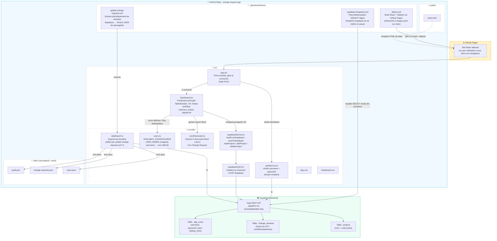

```mermaid
flowchart TB

    subgraph GH["🐙 GitHub Repo : change-request-app"]
        direction TB

        subgraph WORKFLOWS["📂 .github/workflows/"]
            deploy["deploy.yml<br/>Build React + Déploie sur GitHub Pages<br/>(déclenché à chaque push sur main)"]
            keepalive["supabase-keepalive.yml<br/>Ping hebdomadaire (SELECT léger)<br/>Empêche Supabase de se mettre en pause"]
            updateCR["update-change-requests.yml<br/>Exporte périodiquement les données<br/>Supabase → fichiers JSON de sauvegarde"]
        end

        subgraph SRC["📂 src/"]
            AppTsx["App.tsx<br/>Point d'entrée, gère la connexion<br/>(login form)"]
            Dashboard["Dashboard.tsx<br/>Composant principal :<br/>Table/Kanban, CR, Status workflow,<br/>colonnes, projets, signatures"]
            AppCss["App.css"]
            DashCss["Dashboard.css"]

            subgraph UTILS["📂 src/utils/"]
                authService["authService.ts<br/>Vérifie username + password<br/>(bcrypt compare)"]
                supaClient["supabaseClient.ts<br/>Initialise la connexion<br/>à l'API Supabase"]
                supaService["supabaseService.ts<br/>loadFromSupabase / saveToSupabase<br/>loadProjects / addProject / deleteProject"]
                users["users.ts<br/>AVAILABLE_STAKEHOLDERS<br/>USER_NAMES (mapping username → nom affiché)"]
                wordGen["wordGenerator.ts<br/>Génère le document Word (.docx)<br/>d'un Change Request"]
                dataExport["dataExport.ts<br/>Exporte les données<br/>(utilisé par update-change-requests.yml ?)"]
            end
        end

        subgraph DATA["📂 data/ (sauvegarde / seed)"]
            auditJson["audit.json"]
            crJson["change-requests.json"]
            usersJson["users.json"]
        end

        subgraph PUBLIC["📂 public/"]
            indexHtml["index.html"]
        end
    end

    subgraph PAGES["🌐 GitHub Pages"]
        site["Site React déployé<br/>(ce que l'utilisateur ouvre dans son navigateur)"]
    end

    subgraph SUPA["☁️ Supabase (backend)"]
        direction TB
        tableUsers["Table : app_users<br/>username, password_hash, display_name"]
        tableCR["Table : change_requests<br/>(toutes les CR + workflow/signatures)"]
        tableProjects["Table : projects<br/>(nom + code projet)"]
        restApi["Data REST API<br/>(appelée via anon/publishable key)"]
    end

    %% Relations de build / déploiement
    deploy -->|npm run build + déploie| site
    keepalive -->|requête SELECT toutes les semaines| restApi

    %% Relations applicatives (runtime, côté utilisateur)
    site --> AppTsx
    AppTsx -->|vérifie identifiants| authService
    authService -->|lit| restApi
    restApi --> tableUsers

    AppTsx -->|si connecté| Dashboard
    Dashboard -->|charge/sauvegarde CR| supaService
    Dashboard -->|génère export Word| wordGen
    Dashboard -->|noms affichés / liste stakeholders| users

    supaService --> supaClient
    supaClient --> restApi
    restApi --> tableCR
    restApi --> tableProjects

    %% Sauvegarde périodique
    updateCR -->|exécute| dataExport
    dataExport -->|lit| restApi
    dataExport -->|écrit dans| crJson
    dataExport -->|écrit dans| auditJson
    dataExport -->|écrit dans| usersJson

    indexHtml -.->|template HTML de base| site

    style GH fill:#f0f9ff,stroke:#00b0db
    style SUPA fill:#ecfdf5,stroke:#10b981
    style PAGES fill:#fef3c7,stroke:#f59e0b
    style WORKFLOWS fill:#fff,stroke:#ccc
    style SRC fill:#fff,stroke:#ccc
    style UTILS fill:#fff,stroke:#ddd
    style DATA fill:#fff,stroke:#ccc
    style PUBLIC fill:#fff,stroke:#ccc
```
